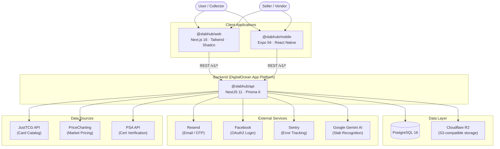

# ARCHITECTURE.md — SlabHub

> Comprehensive architecture documentation for the SlabHub monorepo.
> Last updated: **2026-03-19**

---

## 1. PROJECT STRUCTURE 

SlabHub is a **pnpm workspace monorepo** for managing TCG (Trading Card Game) inventory, card catalogs, pricing, and vendor storefronts. The codebase is organized by architectural layer.

```text
slabhub/
├── apps/
│   ├── api/                          # NestJS REST API (backend)
│   │   ├── src/
│   │   │   ├── main.ts              # Bootstrap, CORS, Swagger, global prefix (/v1)
│   │   │   ├── app.module.ts        # Root module (Zod-validated env config)
│   │   │   ├── instrument.ts        # Sentry SDK initialization
│   │   │   ├── console.ts           # CLI entry point (nest-commander)
│   │   │   ├── common/
│   │   │   │   └── interceptors/    # SentryInterceptor
│   │   │   └── modules/
│   │   │       ├── auth/            # Email OTP authentication (Resend)
│   │   │       ├── oauth-facebook/  # Facebook OAuth2 login
│   │   │       ├── profile/         # Seller profile CRUD
│   │   │       ├── inventory/       # Inventory item management (CRUD, stages, Kanban)
│   │   │       ├── cards/           # Card catalog (CardProfile, CardVariant)
│   │   │       ├── pricing/         # PricingSnapshot management
│   │   │       ├── market/          # Market pricing lookups
│   │   │       ├── media/           # Media upload to S3 (deduplicated by SHA256)
│   │   │       ├── grading/         # Slab/grading recognition (Gemini AI)
│   │   │       ├── justtcg/         # JustTCG API catalog sync (games, sets, products)
│   │   │       ├── pricecharting-crawler/ # PriceCharting web scraper (Cheerio + BrightData proxy)
│   │   │       ├── analytics/       # Shop event analytics (views, inquiries, traffic sources)
│   │   │       ├── vendor/          # Public vendor/shop pages API
│   │   │       ├── workflow/        # Custom workflow statuses per user
│   │   │       ├── invites/         # Invite-only registration system
│   │   │       ├── waitlist/        # Pre-launch waitlist
│   │   │       ├── health/          # Health check endpoint
│   │   │       └── prisma/          # Prisma service (shared DB client)
│   │   └── package.json             # @slabhub/api
│   │
│   ├── web/                          # Next.js web frontend
│   │   ├── src/
│   │   │   ├── app/
│   │   │   │   ├── layout.tsx       # Root layout
│   │   │   │   ├── page.tsx         # Landing / public page
│   │   │   │   ├── globals.css      # Tailwind CSS globals
│   │   │   │   ├── (auth)/          # Login / OTP verification routes
│   │   │   │   ├── (app)/           # Authenticated app routes
│   │   │   │   │   ├── dashboard/   # Analytics dashboard
│   │   │   │   │   ├── inventory/   # Inventory management (list, Kanban, drawer)
│   │   │   │   │   ├── pricing/     # Price lookup tool
│   │   │   │   │   ├── settings/    # User/shop settings
│   │   │   │   │   ├── shop/        # Shop preview
│   │   │   │   │   └── invites/     # Invite management
│   │   │   │   ├── vendor/          # Public vendor storefront ([handle])
│   │   │   │   ├── onboarding/      # New user onboarding flow
│   │   │   │   └── invite/          # Invite acceptance page
│   │   │   ├── components/
│   │   │   │   ├── ui/              # Shadcn UI primitives (Button, Dialog, Select, etc.)
│   │   │   │   ├── common/          # Shared components
│   │   │   │   ├── dashboard/       # AnalyticsDashboard, charts (Recharts)
│   │   │   │   ├── inventory/       # InventoryList, ItemDrawer, Kanban board
│   │   │   │   ├── pricing/         # Price lookup cards
│   │   │   │   ├── settings/        # Settings forms
│   │   │   │   ├── layout/          # App shell, sidebar, header
│   │   │   │   ├── landing/         # Landing page components
│   │   │   │   ├── auth-provider.tsx # Auth context (session cookie)
│   │   │   │   └── theme-provider.tsx# next-themes dark/light
│   │   │   └── lib/
│   │   │       ├── api.ts           # Centralized API client (fetch wrapper)
│   │   │       ├── types.ts         # Shared TypeScript types
│   │   │       ├── utils.ts         # General utilities
│   │   │       ├── theme.ts         # Theme config
│   │   │       ├── image-utils.ts   # Image URL helpers
│   │   │       └── inventory-validation.ts # Zod schemas for inventory forms
│   │   └── package.json             # @slabhub/web
│   │
│   ├── mobile/                       # Expo / React Native app
│   │   ├── app/
│   │   │   ├── _layout.tsx          # Root layout (Expo Router)
│   │   │   ├── (auth)/              # Login / OTP screens
│   │   │   ├── (tabs)/             # Tab-based navigation
│   │   │   │   ├── index.tsx        # Home / Dashboard
│   │   │   │   ├── inventory.tsx    # Inventory list
│   │   │   │   ├── pricing.tsx      # Price lookup
│   │   │   │   └── profile.tsx      # Profile / settings
│   │   │   ├── add-item.tsx         # Add inventory item screen
│   │   │   └── item/               # Item detail screens
│   │   ├── components/
│   │   │   ├── MarketValueChart.tsx  # Market value chart
│   │   │   ├── ShareCard.tsx        # Social share card generator
│   │   │   ├── onboarding/          # Onboarding flow components
│   │   │   └── pricing/             # Pricing UI components
│   │   ├── contexts/                # React contexts (auth, etc.)
│   │   ├── lib/                     # API client, utilities
│   │   ├── constants/               # App constants
│   │   └── package.json             # @slabhub/mobile (Expo 54)
│   │
│   └── landing/                      # Marketing landing page (Next.js static export)
│
├── prisma/
│   ├── schema.prisma                 # Database schema (571 lines, 25+ models)
│   ├── migrations/                   # Migration history
│   └── seed.ts                       # Development seed data
│
├── infra/
│   └── docker/
│       └── docker-compose.yml        # PostgreSQL 16 (local dev)
│
├── scripts/
│   └── generate-placeholders.mjs     # Image placeholder generator
│
├── Dockerfile                        # Production API container (node:20-slim + pnpm)
├── netlify.toml                      # Netlify build config + API proxy redirects
├── pnpm-workspace.yaml               # Workspace: apps/*, packages/*
├── AGENTS.md                         # AI agent rules/conventions
└── package.json                      # Root: dev scripts, prisma, engines (Node 20)
```

---

## 2. HIGH-LEVEL SYSTEM DIAGRAM



**Request Flow:**
1. Client apps (Web / Mobile) send REST requests to `/v1/*` endpoints
2. Netlify proxies `/api/*` → DigitalOcean App Platform for the web frontend
3. Mobile app connects directly to the API URL
4. API validates sessions via `HttpOnly` session cookies (web) or `Authorization` header (mobile)
5. API interacts with PostgreSQL via Prisma ORM and Cloudflare R2 via AWS S3 SDK

---

## 3. CORE COMPONENTS

### @slabhub/api — Backend API

| Aspect | Detail |
|--------|--------|
| **Framework** | NestJS 11, TypeScript |
| **ORM** | Prisma 6 with PostgreSQL |
| **Auth** | Email OTP (Resend) + Facebook OAuth2 + Session cookies |
| **Validation** | `class-validator` / `class-transformer` (global `ValidationPipe`) + Zod for env config |
| **API Docs** | Swagger UI at `/api/docs`, JSON at `/api/docs-json` |
| **Prefix** | Global prefix `/v1` (excludes `health`, `api/docs`) |
| **CLI** | `nest-commander` for data sync scripts (JustTCG, PriceCharting, price sync, grading) |
| **Image Processing** | `sharp` for image optimization |
| **Monitoring** | Sentry SDK (`@sentry/nestjs`) with global filter + interceptor |
| **Rate Limiting** | `@nestjs/throttler` |

**Module Inventory (18 modules):**

| Module | Purpose |
|--------|---------|
| `AuthModule` | Email OTP flow (send code → verify → create session) |
| `OauthFacebookModule` | Facebook OAuth2 social login |
| `ProfileModule` | Seller profile CRUD (handle, shop name, socials, avatar) |
| `InventoryModule` | Inventory items CRUD, bulk ops, status/stage management |
| `CardsModule` | Card catalog (CardProfile + CardVariant) lookups |
| `PricingModule` | PricingSnapshot management |
| `MarketModule` | Market price lookups across data sources |
| `MediaModule` | S3 upload/download, SHA256 dedup, image optimization |
| `GradingModule` | AI-powered slab recognition via Google Gemini |
| `JustTcgModule` | Catalog sync from JustTCG API (games, sets, products) |
| `PriceChartingCrawlerModule` | Web scraper (Cheerio) with BrightData proxy for market data |
| `AnalyticsModule` | Shop traffic analytics (views, inquiries, referrer/channel tracking) |
| `VendorModule` | Public vendor storefront API |
| `WorkflowModule` | Custom per-user workflow statuses (Kanban) |
| `InviteModule` | Invite-only registration with token codes |
| `WaitlistModule` | Pre-launch email waitlist |
| `HealthModule` | `GET /health` endpoint |
| `PrismaModule` | Shared Prisma client service |

---

### @slabhub/web — Web Frontend

| Aspect | Detail |
|--------|--------|
| **Framework** | Next.js 16 (App Router), React 19 |
| **Styling** | Tailwind CSS 4, Shadcn UI (Radix primitives), `tw-animate-css` |
| **State** | React Hook Form (`@hookform/resolvers` + Zod), `sonner` toasts |
| **Charts** | Recharts 2.15 |
| **Drag & Drop** | `@dnd-kit/core` + `@dnd-kit/sortable` (Kanban reordering) |
| **Carousel** | Embla Carousel (image galleries) |
| **Theming** | `next-themes` (dark/light mode) |
| **Icons** | Lucide React |
| **Hosting** | Netlify (static export → `/api/*` proxied to backend) |

**Key Routes:**

| Route Group | Pages |
|-------------|-------|
| `(auth)` | Login, OTP verification |
| `(app)/dashboard` | Analytics dashboard (traffic sources, market value chart) |
| `(app)/inventory` | Inventory list view + Kanban board + item drawer |
| `(app)/pricing` | Price lookup tool |
| `(app)/settings` | Shop settings, profile |
| `(app)/shop` | Shop preview |
| `(app)/invites` | Invite link management |
| `vendor/[handle]` | Public vendor storefront (SSR) |
| `onboarding` | New user setup wizard |
| `invite` | Invite acceptance |

---

### @slabhub/mobile — Mobile App

| Aspect | Detail |
|--------|--------|
| **Framework** | Expo 54, React Native 0.81, Expo Router 6 |
| **State** | `@tanstack/react-query` for server state, React Context for auth |
| **Storage** | `expo-secure-store` (tokens), `@react-native-async-storage/async-storage` |
| **Camera/Media** | `expo-image-picker`, `expo-image-manipulator`, `expo-image` |
| **Sharing** | `react-native-share`, `react-native-view-shot` (share card generation) |
| **Fonts** | `@expo-google-fonts/inter` |
| **Animations** | `react-native-reanimated` 4.1 |
| **Platforms** | iOS + Android (native builds via `expo run:ios` / `expo run:android`) |

**Tab Navigation:**

| Tab | Purpose |
|-----|---------|
| Home | Dashboard with market value chart |
| Inventory | Inventory list with search/filter |
| Pricing | Price lookup tool |
| Profile | User profile and settings |

**Additional Screens:** Add Item (with image capture), Item Detail.

---

### @slabhub/landing — Landing Page

Static marketing landing page (Next.js static export). Currently minimal; output in `.next/` directory.

---

## 4. DATA STORES

### PostgreSQL 16 (Primary Database)

| Model Group | Models | Purpose |
|-------------|--------|---------|
| **Users & Auth** | `User`, `Session`, `OtpChallenge`, `OAuthIdentity` | User accounts, sessions, OTP codes, social logins |
| **Seller** | `SellerProfile` | Shop profile (handle, name, socials, avatar, payments, fulfillment) |
| **Inventory** | `InventoryItem`, `InventoryHistory`, `WorkflowStatus` | Items with stages (ACQUIRED→SOLD), audit history, custom Kanban statuses |
| **Card Catalog** | `CardProfile`, `CardVariant`, `PricingSnapshot` | Card data with variant support (normal/alt art/foil) and pricing |
| **Reference Data** | `RefGame`, `RefSet`, `RefPrinting`, `RefProduct`, `RefSyncProgress` | JustTCG-synced reference catalogs |
| **PriceCharting** | `RefPriceChartingProduct`, `RefPriceChartingSet`, `PriceChartingSales` | Scraped pricing data and sales history |
| **Media** | `Media` | SHA256-deduplicated file records (S3 key reference) |
| **Analytics** | `ShopEvent` | Traffic events: `VIEW_SHOP`, `VIEW_ITEM`, `INQUIRY_START`, `INQUIRY_COMPLETE` |
| **Invites** | `Invite`, `InviteAcceptance` | Invite-based registration tokens |
| **Waitlist** | `WaitlistParticipant` | Pre-launch email collection |

**Key Enums:** `InventoryStage` (8 values), `ItemType` (RAW/GRADED/SEALED), `GradeProvider` (PSA/BGS/CGC/ARS/SGC/OTHER), `Condition` (NM/LP/MP/HP/DMG), `ProductType` (12 sealed types), `VariantType`, `Language` (JP/EN).

**Primary Key Strategy:** CUID (`@default(cuid())`) for all models except `CardProfile` (domain ID).

---

### Cloudflare R2 (Object Storage)

| Bucket | Purpose |
|--------|---------|
| `upload` (prod) | Production media files (card images, slab photos, avatars) |
| `slabhub-files-dev` (dev) | Development media files |

- **CDN:** `https://cdn.slabhub.gg` (Cloudflare CDN in front of R2)
- **Deduplication:** Media files are SHA256-hashed before upload; duplicate uploads are detected and reuse existing records
- **Max upload size:** 15 MB
- **Allowed MIME types:** `image/jpeg`, `image/png`, `image/webp`

---

## 5. EXTERNAL INTEGRATIONS

| Service | Purpose | Integration Method |
|---------|---------|-------------------|
| **Resend** | Transactional email (OTP codes for passwordless auth) | REST API via `resend` npm package |
| **Facebook** | OAuth2 social login | Server-side OAuth flow (`FACEBOOK_APP_ID` / `FACEBOOK_APP_SECRET`) |
| **Google Gemini AI** | Slab/card recognition from images | `@google/generative-ai` SDK |
| **JustTCG API** | Card catalog synchronization (games, sets, products, printings) | REST API with multi-key rotation for rate limiting |
| **PriceCharting** | Market pricing data scraping (One Piece TCG + others) | Web scraper (`cheerio`) with BrightData proxy for anti-bot bypass |
| **PSA API** | Grading certification verification | REST API (`PSA_API_TOKEN`) |
| **BrightData** | Proxy service for PriceCharting scraping | HTTPS proxy agent (`BRIGHTDATA_CUSTOMER_ID` / `BRIGHTDATA_ZONE` / `BRIGHTDATA_TOKEN`) |
| **Sentry** | Error tracking and performance monitoring | `@sentry/nestjs` SDK with global filter + interceptor |
| **Cloudflare R2** | S3-compatible object storage for media | AWS SDK v3 (`@aws-sdk/client-s3`, `@aws-sdk/s3-request-presigner`) |
| **GeoIP** | Country-level geolocation for analytics | `geoip-lite` (local DB, no external calls) |
| **Discord** | Webhook notifications for shop events | Seller-configured webhook URL (`discordWebhookUrl` on `SellerProfile`) |

---

## 6. DEPLOYMENT & INFRASTRUCTURE

### Production Architecture

```text
┌─────────────┐     ┌──────────────────────────────┐     ┌──────────────┐
│   Netlify    │────▷│ DigitalOcean App Platform    │────▷│ PostgreSQL   │
│ (Web Static) │     │ (API Container: node:20-slim) │     │ (Managed DB) │
└─────────────┘     └──────────────────────────────┘     └──────────────┘
       │                         │
       │                         ▼
       │                  ┌──────────────┐
       │                  │ Cloudflare R2│
       │                  │ (CDN + Storage)│
       │                  └──────────────┘
       ▼
  cdn.slabhub.gg
  slabhub.gg
```

| Component | Platform | Details |
|-----------|----------|---------|
| **Web Frontend** | Netlify | Static export of Next.js; `/api/*` proxied to DigitalOcean backend |
| **API Server** | DigitalOcean App Platform | Dockerized NestJS (`node:20-slim`, pnpm 9.15, port 3001) |
| **Database** | DigitalOcean Managed PostgreSQL 16 | Production database |
| **Object Storage** | Cloudflare R2 | Media files served via `cdn.slabhub.gg` |
| **Mobile** | Apple App Store / Google Play | Expo-built native apps |
| **DNS / CDN** | Cloudflare | DNS routing, R2 CDN |
| **Monitoring** | Sentry | Error tracking, performance monitoring |

### Domains

| Domain | Purpose |
|--------|---------|
| `slabhub.gg` | Primary web app |
| `cdn.slabhub.gg` | Media CDN (Cloudflare R2) |
| `slabhub-dev-kksal.ondigitalocean.app` | API backend (proxied from Netlify) |
| `shub.it` | Short URL domain |

### Local Development

```bash
# 1. Install dependencies
pnpm install

# 2. Start PostgreSQL (Docker)
pnpm db:up                    # docker compose -f infra/docker/docker-compose.yml up -d

# 3. Run database migrations
pnpm prisma:migrate

# 4. Seed development data (optional)
pnpm seed

# 5. Start all apps in parallel
pnpm dev                      # runs API (port 3001) + Web (port 3000)
# or individually:
pnpm dev:api                  # NestJS on :3001
pnpm dev:web                  # Next.js on :3000
pnpm dev:mobile               # Expo dev server
```

### Container Build

```dockerfile
# node:20-slim → pnpm 9.15 → prisma generate → nest build → start:prod
docker build -t slabhub-api .
docker run -p 3001:3001 --env-file .env slabhub-api
```

---

## 7. SECURITY CONSIDERATIONS

### Authentication (Two-Stage)

| Stage | Method | Details |
|-------|--------|---------|
| **1. Identity** | Email OTP | 6-digit code sent via Resend; SHA256-hashed in `OtpChallenge`; 10-min TTL; max 5 attempts |
| **1. Identity** | Facebook OAuth2 | Server-side flow; creates/links `OAuthIdentity` |
| **2. Session** | Cookie-based | `HttpOnly`, `Secure` session cookie (`slabhub-session`); 30-day TTL; token SHA256-hashed in `Session` table |

### Authorization

- **Invite-only registration:** Controlled via `INVITE_ONLY_REGISTRATION` env flag
- **Role model:** Currently single-tenant seller profiles; each user owns their own inventory
- **Ownership enforcement:** All inventory/profile queries are scoped by authenticated `userId`

### Data Protection

| Measure | Implementation |
|---------|---------------|
| **Media deduplication** | SHA256 hash of file content; prevent duplicate uploads |
| **OTP security** | Code hashed (SHA256 + salt) in DB; attempt limiting; expiry |
| **Session tokens** | SHA256-hashed before storage; `HttpOnly` + `Secure` cookies |
| **Input validation** | Global `ValidationPipe` (whitelist, forbid non-whitelisted, transform) |
| **Env validation** | Zod schema validates all env vars at startup |
| **CORS** | Configurable `ALLOWED_ORIGINS`; credentials enabled |
| **IP hashing** | Shop analytics store `ipHash` for unique visitor counting without PII |
| **Secrets** | Sensitive env vars managed outside codebase (`.env` in `.gitignore`) |

---

## 8. DEVELOPMENT & TESTING

### Prerequisites

- **Node.js** 20.x
- **pnpm** (workspace-based package manager)
- **Docker** (for local PostgreSQL)
- **Expo CLI** (for mobile development)

### Testing

| Layer | Framework | Command |
|-------|-----------|---------|
| **API Unit/Integration** | Jest + `@nestjs/testing` | `pnpm --filter @slabhub/api test` |
| **API Watch** | Jest watch mode | `pnpm --filter @slabhub/api test:watch` |
| **Linting** | ESLint + Prettier + TypeScript strict | `pnpm lint` |

- **Test OTP:** Hardcoded `000000` OTP code for E2E tests requiring authentication
- **Test pattern:** Tests live alongside source files as `*.spec.ts`

### Data Sync CLI Commands

```bash
pnpm justtcg:sync:dictionaries   # Sync JustTCG games, sets, printings
pnpm justtcg:sync:catalog        # Sync JustTCG product catalog
pnpm justtcg:sync:all            # Full JustTCG sync
pnpm pricecharting:crawl:onepiece # Crawl PriceCharting One Piece TCG data
pnpm inventory:sync:prices       # Sync market prices to inventory items
pnpm grading:test-recognition    # Test Gemini AI slab recognition
```

### Code Quality

- **TypeScript** strict mode across all apps
- **ESLint** with framework-specific configs (NestJS, Next.js, Expo)
- **Prettier** for formatting
- **Swagger decorators** required on all API endpoints and DTOs (`@ApiTags`, `@ApiOperation`, `@ApiResponse`, `@ApiProperty`)
- **Prisma migrations** required for any schema change

---

## 9. FUTURE CONSIDERATIONS

- **Multi-tenant scaling:** Enhanced seller isolation, custom domain support for vendor pages
- **TCG expansion:** Extending catalog/crawlers to support Pokémon, Magic: The Gathering, Yu-Gi-Oh!, and more
- **Marketplace integration:** Direct listing to eBay, TCGPlayer, Facebook Marketplace
- **Distribution features:** Auto-posting to social media (Facebook Groups, Telegram, Discord)
- **Advanced mobile features:** On-device image recognition for slabs and cards
- **Shared packages:** `packages/shared` directory reserved for cross-app type sharing

---

## 10. GLOSSARY

| Term | Definition |
|------|-----------|
| **TCG** | Trading Card Game |
| **Slab** | A professionally graded and encapsulated trading card in a sealed case |
| **Raw** | An ungraded, loose trading card |
| **PSA / BGS / CGC / ARS / SGC** | Major third-party card grading companies |
| **OTP** | One-Time Password (used for passwordless email authentication) |
| **CUID** | Collision-resistant Unique Identifier (used as primary keys) |
| **NM / LP / MP / HP / DMG** | Card conditions: Near Mint, Lightly Played, Moderately Played, Heavily Played, Damaged |
| **Stage** | Inventory lifecycle state (ACQUIRED → IN_TRANSIT → BEING_GRADED → AUTHENTICATED → IN_STOCK → LISTED → SOLD → ARCHIVED) |
| **Vendor / Seller** | A user who manages and sells TCG inventory |
| **Handle** | Unique slug for a seller's public storefront URL (`/vendor/{handle}`) |
| **PriceCharting** | Third-party website for TCG market pricing data |
| **JustTCG** | Third-party API for TCG card catalog data |
| **Kanban** | Visual board layout for organizing inventory by workflow status |
| **R2** | Cloudflare's S3-compatible object storage service |

---

## 11. PROJECT IDENTIFICATION

| Field | Value |
|-------|-------|
| **Project Name** | SlabHub |
| **Repository** | [github.com/cfwme/slabhub](https://github.com/cfwme/slabhub) |
| **Primary Domains** | `slabhub.gg`, `shub.it` |
| **Primary Contact** | SlabHub Team |
| **Node Version** | 20.x |
| **Package Manager** | pnpm (workspace monorepo) |
| **Last Updated** | 2026-03-19 |
